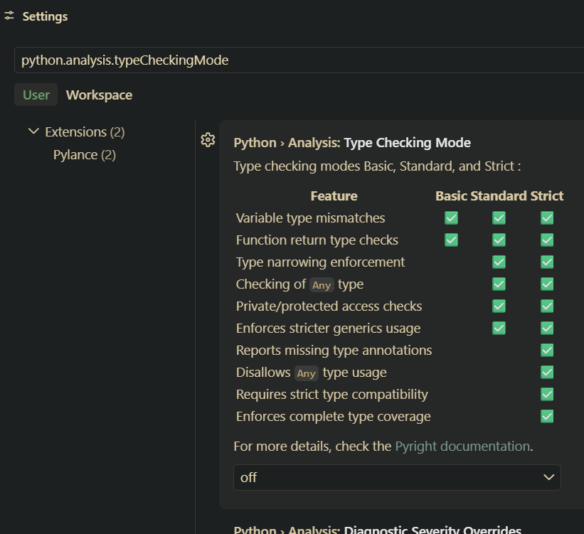

# Typer i Python

Vi har typisk bare definert variabler på denne måten:

```python
tall = 3
print(type(tall))
```

Det ligger i kortene at den som skriver koden har `tenkt` at man skulle lagre tall i denne variabelen, men det er IKKE gitt at faktisk blir tilfelle. Kanskje man ikke skriver på norsk? Kanskje man ikke bryr seg?

Et enkelt grep du kan gjøre er å spesifisere at du ønsker at denne variabelen skal inneholde en spesifikk type, som dette. Dette kalles gjerne "type hints" eller typeannotasjoner på engelsk:

```python
alder: int = 16
print(type(alder))

lengde: float = 4.5
print(type(lengde))

navn: str = "Ola"
print(type(navn))

gammel_nok: bool = True
print(type(gammel_nok))

```

Videre, for mer avanserte datatyper kan du bruke:

```python
liste_navn: list = ["Ola", "Kari", "Per"]
print(type(liste_navn))

dict_personer: dict = {"Ola": 16, "Kari": 17, "Per": 18}
print(type(dict_personer))
```

..eller enda bedre:

```python
# Ny og bedre måte (spesifiserer innholdet):
liste_navn: list[str] = ["Ola", "Kari", "Per"]
dict_personer: dict[str, int] = {"Ola": 16, "Kari": 17, "Per": 18}
```

Fordelen er at verktøy som VS Code og mypy nå har nok informasjon til å oppdage flere feil. Med bare `list` ville for eksempel `liste_navn.append(5)` blitt godtatt uten varsel, mens `list[str]` gjør at det samme kallet blir markert som en feil siden 5 ikke er en streng.

Python sjekker derimot ikke typer automatisk når koden kjører (runtime). Det betyr at dette ikke vil gi en feilmelding i Python når du kjører skriptet:

```python
alder: int = "sytten"  # Python tillater dette ved kjøring
```

VS Code vil derimot gi deg en rød strek eller advarsel dersom du sender inn feil datatype, forutsatt at Python-utvidelsen (Pylance) er installert, og aktivert. Når det gjelder aktiveringen, så fant `Nikolai` ut av dette:

> File > Preferences > Settings - og skriv deretter inn `python.analysis.typeCheckingMode` (eller bla deg frem til Pylance). Endre til en annen verdi enn **off**, typisk **strict**.



<!--  -->

Dersom du eksempelvis bruker `mypy`, så er dette et verktøy du kan kjøre i terminalen for å sjekke at alle typer i prosjektet stemmer før du kjører koden.

## Typer for funksjoner

Type hints brukes ikke bare på variabler, men også på funksjonsparametere og på det en funksjon returnerer:

```python
def hils(navn: str) -> str:
    return f"Hei, {navn}!"

print(hils("Ola"))
```

Her sier `navn: str` at parameteren `navn` skal være en streng, mens `-> str` etter parentesen sier at funksjonen returnerer en streng.

Dersom en funksjon ikke returnerer noe, bruker vi `-> None`:

```python
def skriv_hilsen(navn: str) -> None:
    print(f"Hei, {navn}!")
```

Dette fungerer også sammen med standardverdier for parametere:

```python
def hils(navn: str = "verden") -> str:
    return f"Hei, {navn}!"
```

Akkurat som med variabler sjekker ikke Python dette automatisk når koden kjører:

```python
def legg_saman(a: int, b: int) -> int:
    return a + b

resultat = legg_saman("3", "5")  # Python tillater dette ved kjøring, men gir "35" i stedet for 8
```

VS Code (Pylance) og mypy vil derimot varsle deg om at `"3"` og `"5"` ikke er `int`, slik at du oppdager feilen før du kjører koden i stedet for å bli overrasket over resultatet.